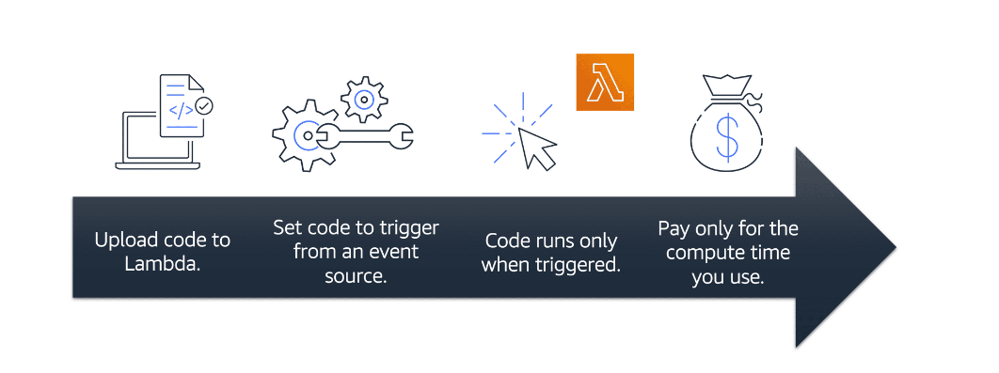

## Table Content 
- [Introduction](#introduction)
- [Cloud Computing](#cloud-computing)
- [Benefit Cloud Computing](#benefits-of-cloud-computing)
- [Amazon Elastic Compute Cloud EC2](#amazon-elastic-compute-cloud-ec2)
- [A global Infrastructure and reliablity](#a-global-infrastructure-and-reliablity)

## Introduction
What is Client Server?
- In computing, a client can be a web browser or desktop application that a person interacts with to make requests to computer servers. 
- A server can be services, such as Amazon Elastic Compute Cloud (Amazon EC2) – a type of virtual server.

## Cloud Computing
Deployment models for cloud computing:
1) Cloud Based Deployment : 
    - Run all parts of the application in the cloud.
    - Migrate existing applications to the cloud.
    - Design and build new applications in the cloud.

note: In a cloud-based deployment model, you can migrate existing applications to the cloud, or you can design and build new applications in the cloud. 
You can build those applications on low-level infrastructure that requires your IT staff to manage them.
Alternatively, you can build them using higher-level services that reduce the management, architecting, and scaling requirements of the core infrastructure.

For example: a company might create an application consisting of virtual servers, databases, and networking components that are fully based in the cloud.

2) On Premises Deployment :
    - Deploy resources by using virtualization and resource management tools.
    - Increase resource utilization by using application management and virtualization technologies.

On-premises deployment is also known as a private cloud deployment. In this model, resources are deployed on premises by using virtualization and resource management tools.

For example: you might have applications that run on technology that is fully kept in your on-premises data center. Though this model is much like legacy IT infrastructure, its incorporation of application management and virtualization technologies helps to increase resource utilization.

3) Hybrid Deployment :
    - Connect cloud-based resources to on-premises infrastructure.
    - Integrate cloud-based resources with legacy IT applications.

In a hybrid deployment, cloud-based resources are connected to on-premises infrastructure. You might want to use this approach in a number of situations. For example, you have legacy applications that are better maintained on premises, or government regulations require your business to keep certain records on premises.

For example: suppose that a company wants to use cloud services that can automate batch data processing and analytics. However, the company has several legacy applications that are more suitable on premises and will not be migrated to the cloud. With a hybrid deployment, the company would be able to keep the legacy applications on premises while benefiting from the data and analytics services that run in the cloud.

## Benefits of Cloud Computing
there is 6 categories the benefit of cloud computing:
- Trade upfront expense for variable expense
- stop spending money to run and maintain data centers 
- Stop guessing capacity
- Benefit from massive economies of scale
- Increase speed and agility
- Go Global in minutes

## Amazon Elastic Compute Cloud EC2
1) Amazon EC2 instance you can use a virtual server to run applications in the AWS Cloud.
    - You can provision and launch an Amazon EC2 instance within minutes.
    - You can stop using it when you have finished running a workload.
    - You pay only for the compute time you use when an instance is running, not when it is stopped or terminated.
    - You can save costs by paying only for server capacity that you need or want.

2) Amazon EC2 instance types:
    - General purpose instances: provide a balance of compute, memory, and networking resources. You can use them for a variety of workloads, such as:
        - application servers
        - gaming servers
        - backend servers for enterprise applications
        - small and medium databases
    
    - Compute optimized instances:  are ideal for compute-bound applications that benefit from high-performance processors. Like heavy use for example: 
        - Web Application or Desktop Application
        - Gaming server 
    
    - Memory optimized instances:  are designed to deliver fast performance for workloads that process large datasets in memory.example :
        - Databases

    - Accelerated computing instances use hardware accelerators, or coprocessors, to perform some functions more efficiently than is possible in software running on CPUs. Examples:
        - floating point number calculations
        -  graphics processing
        - data pattern matching
    
    - Storage optimized instances are designed for workloads that require high, sequential read and write access to large datasets on local storage.

3) Scalling Amazon EC2: called Scalability
    - Amazon EC2 Auto Scaling: when it was busy it automatically add a compute power or ec2 instances  to support your application
    - Elastic Load Balancing : Automatically distribute incoming application traffic to multiple resources
    

4) Messaging and Queueing 
    - Monolithic Application:
        - all components are tightly coupled and typically share the same communication channels.
        -  if one component fails, it can disrupt the entire application’s ability to process messages. 

    - Microservices Application: components are loosely coupled, allowing each service to function independently. For messaging and queueing, two popular AWS services are often utilized:
        - SQS(Amazon Simple Queue Service): SQS is a fully managed message queuing service that allows individual components to send, store, and receive messages asynchronously. This helps in decoupling services, enabling each component to continue working independently even if another component is down or delayed.

        - SNS(Amazon Simple Notification Service) : SNS is a fully managed pub/sub messaging service. It enables applications to send notifications to multiple subscribers (other components or services) at once. SNS allows different parts of the microservices architecture to stay updated with minimal dependencies, improving resilience and scalability.
    
5) Additional Compute Services:
    - Serverless computing (AWS Lambda) :
        - You upload your code to Lambda. 
        - You set your code to trigger from an event source, such as AWS services, mobile applications, or HTTP endpoints.
        - Lambda runs your code only when triggered.
        - You pay only for the compute time that you use. 
    

    - Containers :
        - Amazon Elastic Container Service (ECS): A scalable, high-performance container management service for running and scaling Docker applications on AWS.
        - Amazon Elastic Kubernetes Service (EKS): A managed service for deploying, managing, and scaling Kubernetes applications on AWS, ensuring compatibility with the Kubernetes ecosystem.
        - AWS Fargate: A serverless compute engine for containers, compatible with both ECS and EKS, allowing you to run containers without managing the underlying infrastructure. You pay for the resources your containers use, simplifying scaling and resource management.

## A global Infrastructure and reliablity
1) AWS Regions : 
    - a separate geographical area that contains multiple isolated locations known as Availability Zones (AZs).

2) Availability Zones :
    - May contain multiple data centers that work together as a single AZ.
    - Each Availability Zone is independent from other Availability Zones within the same region, with separate power, cooling, and networking to enhance fault tolerance.
