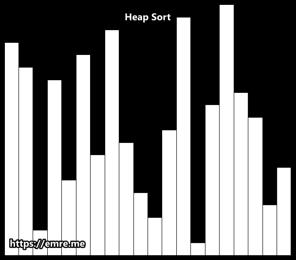

# Sorting Algorithms

## Table of Contents
1. [Insertion Sort](#insertion-sort)
2. [Merge Sort](#merge-sort)
3. [Quick Sort](#quick-sort)
4. [Bubble Sort](#bubble-sort)
5. [Selection Sort](#selection-sort)
6. [Heap Sort](#heap-sort)

---

## Insertion Sort
**How it works:**
- Start with the second number, compare it to the first one and put it in the right spot.
- Then take the third number, compare it with the ones before it, and insert it in the right spot.
- Keep doing this until all the cards are sorted.

---

## Merge Sort
**How it works:**
- Split the number into 2 equals groups.
- Keep splitting each group in half until each group has 1 number.
- Then start combining these small groups back in order.
- Keep doing the split & combining until it's sorted.

---

## Quick Sort
**How it works:**
- Pick one number, like your pivot (number).
- Make all numbers smaller than your pivot to the left and the one that is larger to the right.
- Then take each side and repeat the process.
- Keep doing it until all the cards are in the correct order.

---

## Bubble Sort
**How it works:**
- Start with the first two numbers, compare them.
- If the first number is bigger, swap them.
- Move to the next pair and repeat.
- Keep doing this until you've checked all numbers, and everything is in order.

---

## Selection Sort
**How it works:**
- Look through all numbers and find the smallest one.
- Put that smallest number at the beginning.
- Then look at the remaining numbers, find the next smallest, and put it in the next spot.
- Continue until all numbers are in order.

---

## Heap Sort
**How it works:**
- Build a max heap from the input data.
- The largest element is now at the root of the heap. Replace it with the last item of the heap and reduce the heap size by 1.
- Heapify the root of the tree to maintain the max heap property.
- Repeat this process until the heap size is 1, and the array is sorted.
